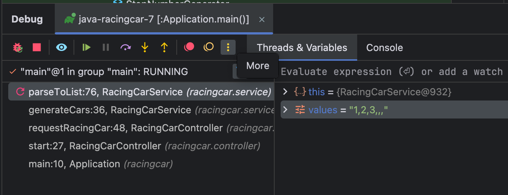
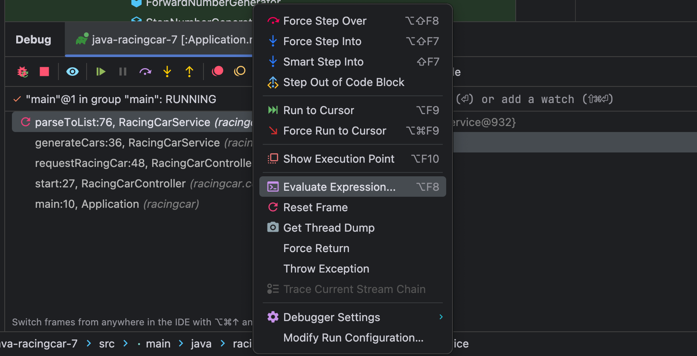
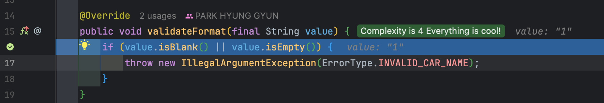
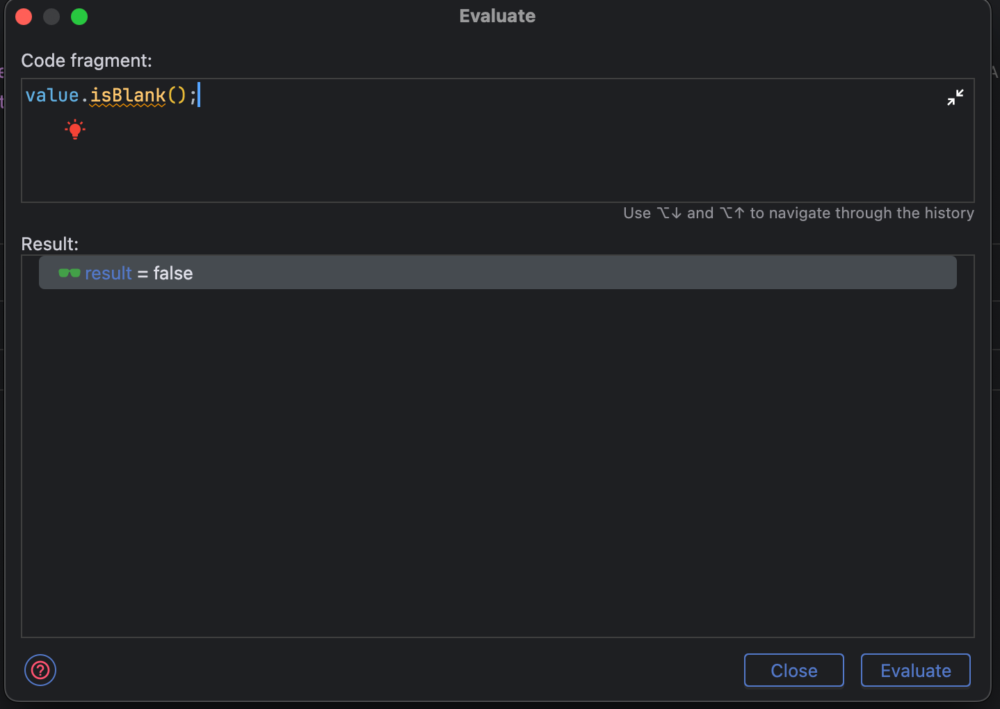

## 🎬 Intro
> 우테코 프리코스 2주차 회고를 적어봅니다~

## 1️⃣ 1주차 공통 피드백 확인하기

#### 1주차 공통 피드백에서 유용한 팁들을 알 수 있었습니다. 그 중 `[10분 테코톡] 웨지의 인텔리제이 디버깅`을 통해 Evaluate 라는 기능을 알게 되었습니다.

---

#### IntelliJ 24.01 버전 기준

### ✅ Evaluate
Evaluate는 `현재 브레이킹 포인트`에서 `클래스의 필드`, `Stack에 저장된 데이터`들을 사용하여 `로직을 돌려보는 기능`입니다.
이처럼 로직을 미리 돌려볼 수 있어서 버그를 잡는거 이외에도 다양한 메서드들을 테스트해볼 수 있습니다. 

#### 사용법



- 디버깅 모드 실행 후 하단의 디버깅 창에서 가장 우측에 있는 More를 클릭합니다.







- Evaluate Expreesion을 선택하면 Evaluate 창이 보이게 됩니다.
- Code fragment 영역에서 현재 브레이킹 포인트에서 돌려볼 수 있는 로직들을 전부 실행할 수 있습니다.
- Result 영역에는 로직의 결과가 출력이 됩니다.
- 예를 들어 위와 같이 value라는 문자열의 isBlank() 결과가 무엇인지 확인해볼 수 있습니다.

## 2️⃣ 요구 사항 파악하기

#### 2주차 요구 사항은 1주차와 유사했으나, 클린코드와 테스트 관련 내용이 추가되어 있었습니다.

---

### ✅ 클린코드를 위한 요구 사항

- Indent depth를 3이 넘지 않도록 구현한다. 2까지만 허용한다.
- 3항 연산자를 쓰지 않는다.
- 함수가 한가지 일만 하도록 최대한 작게 만들어라.

클린코드는 코딩하면서 항상 신경썼었기 때문에 해당 요구 사항들을 지키는건 어렵지 않았습니다.

### ✅ JUnit 5와 AssertJ를 이용하여 정리한 기능 목록이 정상적으로 작동하는지 테스트 코드로 확인한다.
JUnit의 경우 사이드 프로젝트나 혼자 공부할때, 테스트 코드를 매번 작성했었기 때문에 익숙해져있는 상태였습니다 !
다만 1주차 피드백에 테스트들의 볼륨이 너무 크다는 의견을 받았어서, 2주차에는 테스트를 잘게 쪼개어 가독성을 높이는데 신경썼습니다.

## 3️⃣ 문제 분석 하기

#### 사용자에게 자동차의 이름과 경주 시도횟수를 입력받고 그에 대한 결과를 출력하는 것이었습니다. 1주차와 마찬가지로 기능 요구 사항에 기재되지 않은 내용은 스스로 판단해보았습니다.

---

### ✅ 자동차의 이름은 빈문자열을 허용하지 않는다
- 빈문자열을 허용할 경우 누가 우승을 했는지, 알 수가 없기 때문에 허용하지 않는게 맞겠다고 판단하였습니다.

### ✅ 자동차의 이름은 공백으로만 이루어질 수 없다
- 공백의 길이에 따라 자동차를 구분할 수 있겠지만, 사용자가 터미널에서 이를 구분하기에는 어려울것이라 판단하여 해당 제한 사항을 두었습니다.

### ✅ 자동차의 이름은 중복이 될 수 없다
- 이름이 중복될 경우 빈문자열과 비슷한 맥락으로 누가 이겼는지 정확히 구분이 안되기 때문에 중복을 허용하지 않는것으로 구현하였습니다.

### ✅ 자동차의 대수는 1,000 이하로 제한 한다
- 과연 1,000대까지 입력하는 사용자가 있을까 하는 생각이 들기도 하였고, 오버헤드도 고려하는게 맞다고 생각하여 자동차의 대수에 제한을 두었습니다.

### ✅ 시도 횟수는 10,000,000 이하로 제한 한다
- 시도 횟수 만큼 반복문이 돌기 때문에 10e8로 제한하는게 맞다고 판단하였습니다.

그리고 위 5가지 내용들은 언제든지 변경될 수 있는 사항이라고 생각하여 README에 업데이트 내용으로 따로 분리해두었습니다.

## 4️⃣ 기능 구현 목록 작성

#### 1주차 코드 리뷰를 하면서 업데이트 내용을 따로 작성되어 있는 README를 보았습니다. 저 또한 이번에는 살아있는 문서를 만들기 위해 업데이트 내용을 작성하였습니다.

---

### ✨ 업데이트 내용
- 자동차 이름은 빈 값(공백, 빈문자열) 불가
- 자동차 이름 중복 불가
- 경주 시도 횟수는 최대 10,000,000회로 제한
- 참가 가능한 자동차는 최대 1,000대로 제한


### ✅ 진행 과정

#### 1. 경주할 자동차 이름을 `,` (쉼표) 기준으로 구분하여 입력한다

- 자동차 이름은 5글자 이하만 가능하다
- 자동차 이름은 중복되면 안된다
- 자동차 이름 형식은 빈문자열 또는 공백이 될 수 없다
- 자동차는 1000대 까지만 가능하다

```text
pobi,woni,jun
```

#### 2. 시도할 횟수를 입력한다

- 횟수는 양의 정수만 가능하다
- 횟수는 10_000_000로 제한한다

```text
5
```

#### 3. 자동차 별로 횟수 만큼 전진을 수행한다

- 전진하는 조건은 0에서 9 사이에서 무작위 값을 구한 후 무작위 값이 4이상일 경우이다

#### 4. 차수별 실행 결과를 출력한다

- 전진 결과는 자동차 이름과 함께 `-` (하이픈)으로 표현된다

```text
pobi : --
woni : ----
jun : ---
```

#### 5. 최종 우승자를 출력한다

- 단독 우승자 안내 문구

```text
최종 우승자 : pobi
```

- 공동 우승자 안내 문구

```text
최종 우승자 : pobi, jun
```

### ✅ 실행 결과 예시
```text
경주할 자동차 이름을 입력하세요.(이름은 쉼표(,) 기준으로 구분)
pobi,woni,jun
시도할 횟수는 몇 회인가요?
5

실행 결과
pobi : -
woni : 
jun : -

pobi : --
woni : -
jun : --

pobi : ---
woni : --
jun : ---

pobi : ----
woni : ---
jun : ----

pobi : -----
woni : ----
jun : -----

최종 우승자 : pobi, jun
```

### ✅ 클래스 및 기능

#### 1. domain

##### Car

- [X] 자동차의 이름과 위치 정보를 갖고 있는다
- [X] 무작위 숫자에 따라 자동차의 전진을 결정한다
- [X] 해당 자동차가 우승인지 판단한다

##### CarName

- [X] 자동차의 이름 정보를 갖고 있는다

###### 예외처리
- [X] 자동차의 이름이 5글자 초과인 경우
- [X] 자동차의 이름 형식이 빈문자열 또는 공백인 경우

##### Score

- [X] 자동차의 점수 정보를 갖고 있는다

##### Count

- [X] 자동의 횟수 정보를 갖고 있는다

###### 예외처리
- [X] 횟수가 양의 정수가 아닌 경우
- [X] 횟수가 10,000,000를 초과할 경우

##### Racing

- [X] 모든 자동차를 움직이고, 진행 상황을 반환한다
- [X] 최종 우승자를 결정한다

##### RacingCarService

- [X] 자동차 이름으로 자동차를 생성한다
- [X] 경주 결과를 반환한다
- [X] 최종 우승자를 반환한다

###### 예외처리
- [X] 자동차 이름이 중복된 경우
- [X] 자동차의 대수가 1,000대를 초과한 경우

#### 2. util

##### RacingCarStringValidator

- [X] 자동차 이름 길이 검증
- [X] 자동차 이름 형식 검증
- [X] StringValidator의 구현체

##### RacingCarNumberValidator

- [X] 시도 횟수 형식 검증
- [X] 시도 횟수 범위 검증
- [X] NumberValidator의 구현체

##### RacingCarListValidator

- [X] 자동차 이름 중복 검증
- [X] 자동차 대수 검증
- [X] ListValidator의 구현체

##### RandomNumberGenerator

- [X] 0 ~ 9 사이 무작위 값을 생성한다
- [X] NumberGenerator의 구현체

#### 3. controller

- [X] 사용자에게 자동차 이름을 요청한다
- [X] 사용자에게 시도 횟수를 요청한다
- [X] 사용자에게 실행 결과를 반환한다
- [X] 사용자에게 최종 우승자를 반환한다

#### 4. view

##### InputView

- [X] 입력값을 읽는다

##### OutputView

- [X] 요청 메세지를 출력한다
- [X] 실행 결과를 출력한다
- [X] 최종 우승자를 출력한다

#### 5. constant

##### Rule

- [X] 자동차 경주의 룰을 상수로 정의한다

#### ErrorType

- [X] 에러 타입을 정의 한다


## 5️⃣ 구현 하기

#### 1주차 공통 피드백과 코드 리뷰를 하면서 받았던 의견들을 반영하기 위해 노력하였습니다~

> [전체 코드](https://github.com/phk1128/java-racingcar-7)

---

### ✅ 클래스 다이어그램

#### 1. Main


#### 2. util


#### 3. constant


### ✅ 노력한 점

- 테스트를 유연하게 하기 위해 추상화와 DI를 활용하였습니다.
- 의존성 주입을 한곳에서 관리하기 위해 AppConfig 클래스를 두었습니다.(코드 리뷰 피드백)
- 원시값들을 객체로 감싸 데이터의 의미와 책임 분리를 명확하게 하였습니다.
- 테스트의 가독성을 높이기 위해`@ParameterizedTest` 사용을 지양하고, 테스트를 잘게 쪼겠습니다.(코드 리뷰 피드백)
- 각 메서드는 한가지일만 수행하도록 하였습니다.(1주차 공통 피드백)
- indent 3이 넘지 않도록 메서드들을 잘 분리하였습니다.(1주차 공통 피드백)
- 순수한 기능 테스트를 위해 모킹을 적극 활용하였습니다.(코드 리뷰 피드백)
- 일급 컬렉션을 이용하여 객체를 객체답게 사용할려고 노력하였습니다.

## 5️⃣ 험난 했던 리팩토링


